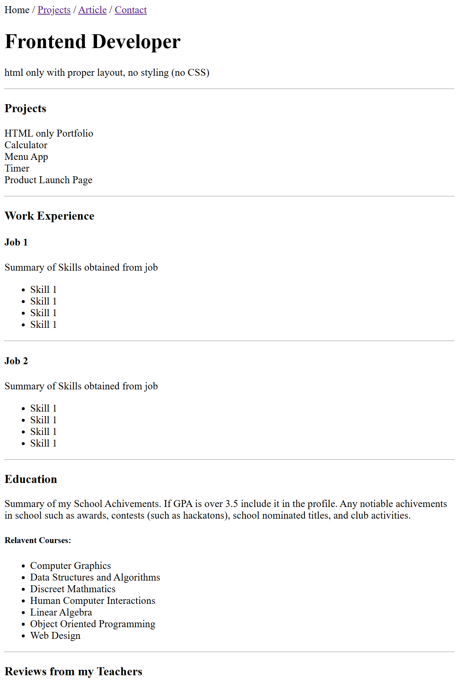
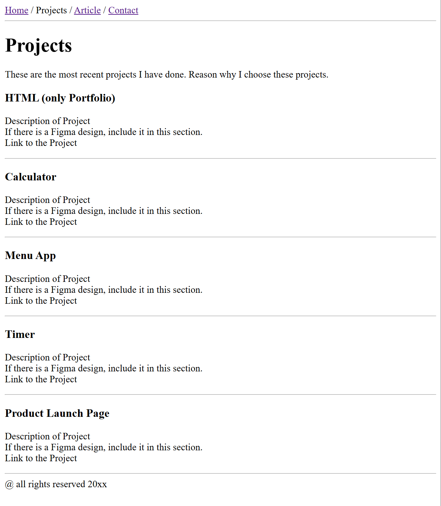
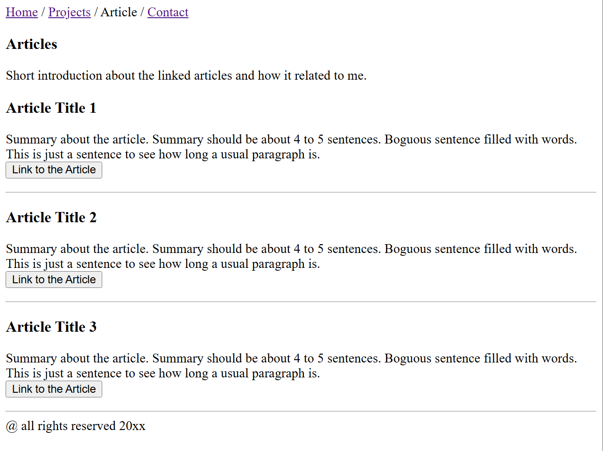
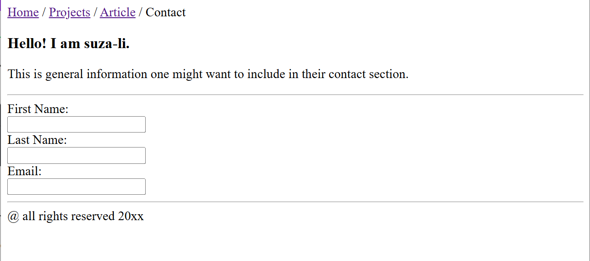

# Basic HTML Website
This is a HTML only website that has multiple pages.
There is a mockup on the project page of roadmap.sh 
that I am to sematically style the HTML after.

# Link to Roadmap.sh
https://roadmap.sh/projects/basic-html-website

# learning Objective
The main purpose of this project is to learn how to
create multiple pages, structure HTML in a semantic way,
future proof the structure, and add SEO meta tags.

# Challenges
The only challenge was the SEO tags. I did not understand
what SEO tags to add for my project. I did a bit of research
and figured out pretty quickly what tags to use.

# Tech Stack
HTML

# Screenshot
These are the HTML only pages of the project.
### Homepage

### Project

### Article

### Contact

